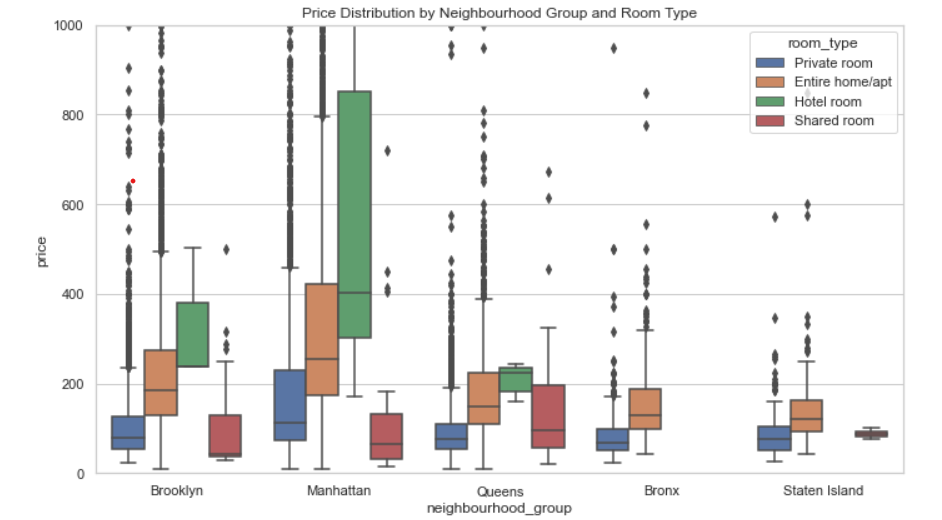

# 🏙️ NYC Airbnb Market Data Analysis

An exploratory data analysis (EDA) project using real-world Airbnb listings data from New York City to uncover insights about pricing, room types, availability, and user engagement. Built with Python and visualized with Seaborn and Matplotlib.

## 🔧 Tools & Technologies
- Python (Pandas, NumPy)
- Data Visualization (Matplotlib, Seaborn)
- Jupyter Notebook
- Data Source: [Inside Airbnb](http://insideairbnb.com/)

## 🧹 Data Cleaning Highlights
- Converted `last_review` to datetime
- Removed listings with price = 0 or price > 5000 (outliers)
- Filled missing values in `reviews_per_month` with 0
- Filtered listings with `minimum_nights` > 365
- Removed rows with missing critical fields like `neighbourhood_group` and `room_type`

## 📊 Key Insights

### 🗽 1. Average Price by Borough
Manhattan is significantly more expensive than other boroughs across all room types.

---

### 🏠 2. Price Distribution by Room Type and Borough
Entire homes cost more across all boroughs, while shared rooms are the most affordable.

---

### 📅 3. Review Activity Over Time
Listings have a consistent review pattern across months, with a spike in recent years.

